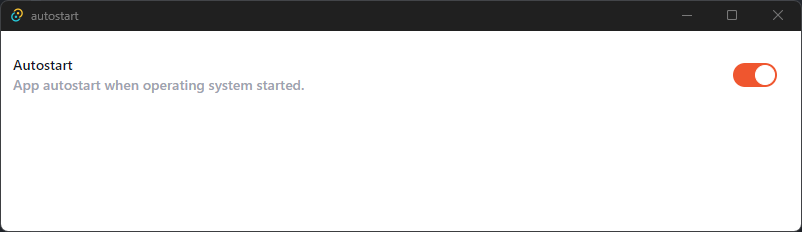

# autostart

Example of Autostart implementation to Tauri.



## Developing

```bash
npm run tauri dev
```

## Building

To create a production version of your app:

```bash
npm run tauri build
```
