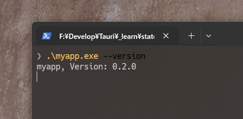
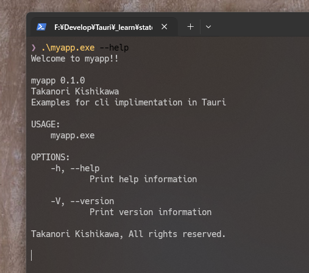

# cli-impl

Example of CLI function implementation to Tauri




## Developing

```bash
npm run tauri dev
```

## Building

To create a production version of your app:

```bash
npm run tauri build
```
